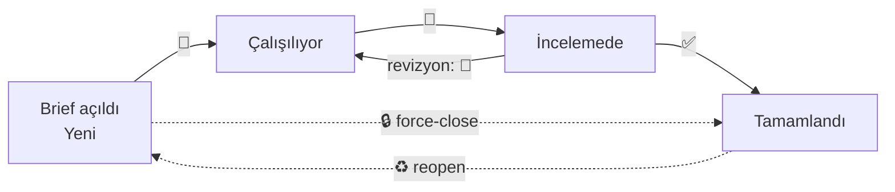

# Benseno Tasarım Sistemi — Kullanım Kılavuzu
**Sürüm:** v7.13 · Mayıs 2026  
**Kapsam:** Tüm ekip — Tasarımcılar · Editörler · AI · Yöneticiler

---

## İçindekiler

0. [⚡ Hızlı Başlangıç](#-hızlı-başlangıç)
1. [Sisteme Genel Bakış](#1-sisteme-genel-bakış)
2. [Slack — Brief Açma](#2-slack--brief-açma)
3. [Slack — Brief Takibi (Reaction Sistemi)](#3-slack--brief-takibi-reaction-sistemi)
4. [Slack — Bildirimler ve DM'ler](#4-slack--bildirimler-ve-dmler)
5. [Dashboard — Genel Kullanım](#5-dashboard--genel-kullanım)
6. [Dashboard — Ekranlar Rehberi](#6-dashboard--ekranlar-rehberi)
7. [Yönetici İşlemleri](#7-yönetici-i̇şlemleri)
8. [Otomatik Raporlar](#8-otomatik-raporlar)
9. [Onboarding — Yeni Ekip Üyesi](#9-onboarding--yeni-ekip-üyesi)
10. [Sistem Çalışma Takvimi](#10-sistem-çalışma-takvimi)
11. [Sık Sorulan Sorular ve Sorun Giderme](#11-sık-sorulan-sorular-ve-sorun-giderme)
12. [Teknik Referans (Yönetici/Teknik)](#12-teknik-referans-yöneticitəknik)
13. [Terim Sözlüğü](#13-terim-sözlüğü)

---

## ⚡ Hızlı Başlangıç

Kılavuzun tamamını okumadan başlamak için rolüne göre 3 madde:

**🎨 Tasarımcıysan:**
1. Sana atanan brief'in **ana mesajına** 🎨 ekle → işe başladın. Sununca 👀, onaylanınca ✅.
2. Reaction'ı **thread'e değil parent mesaja** ekle (yoksa işlenmez).
3. İşlerini Dashboard → **Aktif İşler** veya **Profil** ekranından takip et.

**✍️ Editörsen:**
1. Marka kanalında **"Yeni Brief Aç"** formuyla brief aç (marka, deadline, atanan, tip zorunlu).
2. Aynı gün teslimlerde **saat** gir; geçmiş tarih bilerekse thread'e `teyit` yaz.
3. Teslim gelince onayla; gerekiyorsa 🔒 ile kapat.

**👔 Yöneticiysen:**
1. Her sabah **07:50 DM raporunu** oku — "Bugün senin için 3 aksiyon" bölümüne bak.
2. Önceliği değiştirmek için brief'in parent'ına 🔴🟠🟡🟢 ekle (anlık işlenir).
3. Dashboard → **Yönetici** ekranı + KPI kartlarına tıklayarak ilgili listelere atla.

> Şifre İpek'ten. Dashboard: https://bensenoint.github.io/benseno-tasarim-sistemi/

---

## 1. Sisteme Genel Bakış

### Benseno Tasarım Sistemi Nedir?

Benseno Tasarım Sistemi; 16 kişilik dijital ajans ekibinin 33 marka için ürettiği tasarım ve içerik işlerini Slack üzerinden takip eden, otomatik önceliklendiren, raporlayan ve dashboard'da görselleştiren bir iş akışı platformudur.

### Sistem Neyi Yapar?

- **Her 30 dakikada bir** Slack'teki tüm marka kanallarını tarar, yeni brief'leri tespit eder
- Brief'leri parse ederek öncelik sıralar (deadline'a kalan süreye göre otomatik 🔴🟠🟡🟢)
- Atanan ekip üyelerine Slack DM ile bildirim gönderir
- Geciken, bekleyen, sorunlu brief'leri tespit eder ve uyarı verir
- Tüm veriyi canlı Dashboard'a yansıtır (https://bensenoint.github.io/benseno-tasarim-sistemi/)
- Her sabah 07:50'de yöneticilere ve tüm ekibe özet rapor gönderir

### Kimler Ne Yapar?

| Rol | Ne Yapar |
|-----|----------|
| **Editörler** | Marka kanallarında brief açar, tasarımcı atar, teslimi onaylar |
| **Tasarımcılar** | Atanan brief'te reaction atar (başla/sun/bitir), iş teslim eder |
| **AI (Eren)** | AI brief'lerini alır, tasarımcılarla cross-dept iş yapar |
| **Yöneticiler** | Öncelik override atar (🔴 reaction), sorunları takip eder, rapor okur |
| **Sistem (otomatik)** | Brief'leri parse eder, bildirim gönderir, dashboard'ı günceller, raporlar |

### 3 Departman

- **🎨 Tasarım (7 kişi):** Aylin T, Aykut, Hasan Serdar, Pelin, İpek (Yön.), İrem, Serhat
- **✍️ Editör (8 kişi):** Cansu (Direktör), erdem (Yön.), Eda T, Eda A, Melis, Aylin C, Buse, Simge
- **🤖 AI (1 kişi):** Eren

### 5 Yönetici

| İsim | Unvan |
|------|-------|
| Görkem | Genel Müdür |
| Reyhan | Genel Müdür Yardımcısı |
| Cansu | Direktör (3 departman) |
| İpek | Tasarım Ekibi Yöneticisi |
| erdem | Editör Ekibi Yöneticisi |

---

## 2. Slack — Brief Açma

### 2.1 Brief Hangi Kanalda Açılır?

Her markanın kendine ait Slack kanalı vardır. Brief, o markanın kanalında açılır.

**Kanal → Marka eşleşmesi (33 marka):**

| Kanal | Marka |
|-------|-------|
| #marka-bauhaus | Bauhaus |
| #marka-beta | Beta |
| #marka-cimporglobal | Cimporglobal |
| #marka-cureffect | Cureffect |
| #marka-egosport | Egosport |
| #marka-gursoy | Gürsoy |
| #marka-hasvet | Hasvet |
| #marka-hendex | Hendex |
| #marka-jnj | JNJ |
| #marka-jnj-acuvue-me | JNJ Acuvue ME |
| #marka-jnj-vision-tr | JNJ Vision TR |
| #marka-jungleous | Jungleous |
| #marka-kmr-amos | KMR Amos |
| #marka-kmr-copic | KMR Copic |
| #marka-kmr-lamy | KMR Lamy |
| #marka-kmr-marshmallow | KMR Marshmallow |
| #marka-kmr-max | KMR Max |
| #marka-kmr-panfix | KMR Panfix |
| #marka-kmr-serve | KMR Serve |
| #marka-kuzeypet | Kuzeypet |
| #marka-kzy-bark | KZY Bark |
| #marka-kzy-everclean | KZY Everclean |
| #marka-kzy-ferplast | KZY Ferplast |
| #marka-kzy-flamingo | KZY Flamingo |
| #marka-kzy-simplesolution | KZY Simple Solution |
| #marka-kzy-supreme | KZY Supreme |
| #marka-kzy-vetsbest | KZY Vet's Best |
| #marka-marmaraholding | Marmara Holding |
| #marka-muffik | Muffik |
| #marka-polisan | Polisan |
| #marka-splenda | Splenda |
| #marka-tour2america | Tour2America |
| #marka-vdm-petdent | VDM Petdent |

> ⚠️ `*-editors` veya `*-faq` suffix'li kanallar taranmaz. Brief bu kanallara açılmamalıdır.

---

### 2.2 Brief Nasıl Açılır? — Workflow Yöntemi (Önerilen)

**Adım adım:**

1. İlgili marka kanalını aç (örn. `#marka-bauhaus`)
2. Kanalda **"Yeni Brief Aç"** iş akışı butonuna tıkla
3. Açılan formda aşağıdaki alanları doldur:

| Alan | Açıklama | Zorunlu? |
|------|----------|----------|
| 🎀 İş Özeti | Yapılacak işin kısa açıklaması | ✅ Evet |
| ⏰ Deadline | Teslim tarihi ve saati | ✅ Evet |
| 👷 Kim | Atanan kişi(ler) — Slack @mention ile | ✅ Evet |
| 🏷️ Tip | İş tipi (sosyal medya, banner, video, vb.) | ✅ Evet |
| 🔄 Akış | Paralel / Sıralı | ✅ Evet |
| 🔗 Ref | Referans link (varsa) | Hayır |
| 💬 Not | Ek açıklama | Hayır |
| 🐷 Kimden | Formu açan kişi (otomatik dolar) | Otomatik |

4. **Gönder** — Sistem mesajı kanalda yayınlar

**Sistem otomatik olarak şunu yapar:**
- Brief'i ayrıştırır (parse eder)
- Deadline'dan öncelik hesaplar (🔴🟠🟡🟢)
- Ana Canvas'taki Aktif İşler tablosuna ekler
- Atanan kişiye DM bildirim gönderir
- Dashboard'u günceller

---

### 2.3 Brief Nasıl Açılır? — Manuel Yöntem (Fallback)

Workflow butonu yoksa ya da çalışmıyorsa; kanalda doğrudan mesaj olarak şu format kullanılır:

**🎨 Tasarım brief'i:**
```
📋 [İş özeti]
Atanan: @isim
Deadline: GG Ay YYYY SS:DD
Tip: [iş tipi]
Akış: Paralel
Not: [varsa not]
```

**✍️ Editör brief'i:**
```
✍️ [İş özeti]
Atanan: @isim
Deadline: GG Ay YYYY SS:DD
...
```

**🤖 AI brief'i:**
```
🤖 [İş özeti]
Atanan: @eren
Deadline: GG Ay YYYY SS:DD
...
```

> 💡 İlk satırdaki emoji (📋 / ✍️ / 🤖) departmanı belirler. Bu emoji yoksa sistem atanan kişilerden departmanı tahmin eder.

---

### 2.4 Deadline Kuralları

**Tarih formatı:**
- Workflow formu UTC zaman alır, sistem otomatik İstanbul saatine çevirir
- Manuel brief'te doğrudan `GG Ay YYYY SS:DD TR` formatı kullanılabilir

**Önemli uyarılar:**

- **Aynı gün deadline'lı brief'lerde saat zorunludur.** Saat girilmezse sistem DM ile uyarı gönderir.
- **Geçmişte kalan tarihler** için sistem hem brief thread'inde hem de brief açana DM ile uyarı verir. Bilerek geçmiş tarih girildiyse thread'e `✅ ok` ya da `teyit` yazılmalı, ya da brief'e ✅ reaction eklenmelidir.
- **Mesai dışı saatler** (08:00'den önce veya 17:30'dan sonra) için sistem bilgilendirici bir `🌙 Mesai dışı` etiketi ekler; bu blokaj değildir.

---

### 2.5 Kime Atama Yapılır?

- **`@isim`** → Belirli kişiye atama
- **`@auto`** → Sistem en uygun tasarımcıyı önerir (Smart Assign 2.0: marka uzmanlığı + mevcut iş yükü + streak + müşteri memnuniyeti skoru kullanılır)

> ⚠️ **🔴 Acil brief'lerde `@auto` kullanılmamalıdır.** Sistem otomatik atama önerisini bir sonraki sync'te işler — 8 saatin altında deadline'larda bu gecikme kabul edilemez. Acil durumlarda atananı manuel belirtin.

---

### 2.6 Paralel vs. Sıralı Akış

| Akış | Ne Demek | Ne Zaman |
|------|----------|----------|
| **Paralel** | Tüm atananlar aynı anda çalışabilir | Bağımsız işler |
| **Sıralı** | Birinci bitirmeden ikincisi başlamaz | Tasarım → Editör gibi ardışık süreçler |

Sıralı akışta: birinci kişi işi bitirince sistem otomatik olarak sıradaki kişiye "sıran geldi" DM'i gönderir.

---

## 3. Slack — Brief Takibi (Reaction Sistemi)

Sistem tüm brief durumunu Slack **reaction'ları** üzerinden takip eder. Reaction'lar **her zaman brief'in PARENT mesajına** (ana mesaja) eklenmelidir; thread içine eklenen reaction'lar işlenmez.

### Brief Yaşam Döngüsü



### 3.1 Tasarımcı Reaction Akışı

```
(Brief mesajı geldi)
      ↓
   🎨 ekle        → "İşe başladım" — durum: Çalışılıyor
      ↓
  (Çalış...)
      ↓
   👀 ekle        → "Revize için sunuyorum" — durum: İncelemede
      ↓
  (Editör/müşteri inceler...)
      ↓
  Revizyon varsa:
   🎨 tekrar ekle → "Revizyona başlıyorum" — revizyon sayacı +1
      ↓
   👀 tekrar ekle → Tekrar sunum
      ↓
  Onay gelince:
   ✅ ekle        → "Tamamlandım" — durum: Tamamlandı
```

**Özet:**

| Reaction | Anlamı | Durum |
|----------|--------|-------|
| 🎨 | İşe başladım / Revizyona başlıyorum | Çalışılıyor |
| 👀 | Revize için sunuyorum | İncelemede |
| ✅ | Tamamlandı | Tamamlandı |
| ♻️ | İşi yeniden aç (reopen) | Yeni |

> ⚠️ **Reaction parent mesaja eklenmelidir.** Thread içine yanlışlıkla eklenirse sistem 30 dakika içinde DM ile uyarır.

---

### 3.2 Brief Tamamlama — Buton Yöntemi

Slack Bot'un #benseno-grafik kanalına gönderdiği mesajlarda (veya doğrudan brief mesajında) **"Tamamlandı"** butonu bulunabilir. Bu butona tıklandığında:

1. Canvas'taki brief satırı Aktif İşler → Tamamlananlar tablosuna taşınır
2. Tasarımcıya DM gönderilir: "✅ Brief #N tamamlandı olarak işaretlendi."
3. Dashboard bir sonraki sync'te güncellenir

---

### 3.3 Hayalet İş Uyarısı (30 Dakika Kuralı)

Sistem bir brief'te 30 dakikalık sessizlik tespit ederse ve metinde onay keyword'ü varsa şu soruyu DM ile sorar:

> "Bu iş bitmiş olabilir mi? Tamamlandıysa ✅ ekle, devam ediyorsa 🎨 ekle."

Bu bir blokaj değildir; sadece bilgilendirmedir.

---

### 3.4 Force-Close (🔒)

Yetkili kişiler (lead, editör yöneticisi, yöneticiler) eksik ✅'leri zorla kapatabilir.  
Tasarımcılar da **kendi atandıkları işte** 🔒 kullanabilir (sözlü onay durumunda).

---

## 4. Slack — Bildirimler ve DM'ler

### 4.1 Atama Bildirimi (Şablon 1)

Brief açıldıktan sonra atanan kişi şu formatta DM alır:

```
📋 *[İş özeti]* — [Marka]
⏰ Deadline: [tarih TR]
🏷️ Tip: [iş tipi]
🔄 Akış: [Paralel/Sıralı]
💬 Not: [not]
[Mesaja git](link)
```

---

### 4.2 Sıralı Akış Bildirimi (Şablon 2)

Sıralı işte sıradaki kişiye bildirim:

```
📋 *[İş özeti]* — [Marka]
Sıran yaklaşıyor — [önceki kişi] bitirince başlayabilirsin.
Deadline: [tarih]
[Mesaja git](link)
```

---

### 4.3 Geçmiş Deadline Uyarısı

**Thread'e (Şablon 24):**
```
⚠️ Deadline geçmiş bir tarih: [tarih] ([N] gün geride)

Yanlışlık ise:
• Yeni brief aç (doğru tarihle), bu brief'i sahibin force-close etsin (🔒)

Bilerek geç tarihli kayıt ise:
• Bu thread'e ✅ ok veya teyit yaz → uyarı kalkar
• Veya brief'e ✅ reaction ekle
```

**Brief açana DM (Şablon 25):**
```
⚠️ Az önce açtığın brief'te deadline geçmiş bir tarih var.
[İş özeti] — [Marka]
Deadline: [tarih] ([N] gün geride)
Thread'inde teyit isteniyor.
```

---

### 4.4 Saat Eksik Uyarısı (Şablon 26)

Brief aynı gün teslim ama saat girilmemişse:

```
⏰ Az önce açtığın brief aynı gün teslim ama saat girilmemiş.
[İş özeti] — [Marka]
Deadline: [bugün — saat yok]
Brief thread'ine HH:MM formatında saat yaz, veya yeni brief aç.
```

---

### 4.5 Acil Brief'te @auto Uyarısı (Şablon 18)

🔴 Acil brief'te `@auto` kullanılmışsa:

```
⚠️ 🔴 Acil brief'te @auto kullanma. Atananları manuel belirt.
```

---

### 4.6 Marka Deadline Sapması (E3 — Şablon 27 / 28)

Yalnızca E3 sistemi `active` modda iken çalışır (1 Haziran 2026 ve sonrası).

**Yetersiz süre (Şablon 27):**
```
📈 [Marka] için bu deadline alışılmadık agresif
[İş özeti] — [Marka]
Senin deadline'ın: [N] gün
[Marka] medyan (son 90 gün): [M] gün
Bilgilendirme amaçlı — blokaj değil.
```

**Anormal uzun süre (Şablon 28):**
```
📊 [Marka] için bu deadline alışılmadık geniş
[İş özeti] — [Marka]
Senin deadline'ın: [N] gün
[Marka] medyan: [M] gün
Büyük iş ise normal — iş tipini kontrol et.
```

---

### 4.7 Departman Belirsiz Uyarısı (Şablon 23)

Sistem departmanı tespit edemezse erdem'e (Editör Yöneticisi) DM gönderir:

```
📋 Departman tespit edilemedi — kontrol et:
[İş özeti] — [Marka]
[Mesaja git](link)
```

---

## 5. Dashboard — Genel Kullanım

### 5.1 Erişim

**URL:** https://bensenoint.github.io/benseno-tasarim-sistemi/  
**Şifre:** İlk açılışta bir **giriş ekranı** çıkar; ekip ortak şifresi İpek'ten (Tasarım Yöneticisi) alınır. Doğru şifre girince sekme açık kaldığı sürece tekrar sorulmaz (sekme kapanınca yeniden ister).

> ℹ️ Bu giriş ekranı kazara erişime karşı caydırıcıdır. (Güçlü/sunucu-tarafı koruma için Cloudflare Access yayın-sonrası değerlendirilebilir.)

### 5.2 Giriş ve Görünüm Seçimi

Dashboard ilk açıldığında sağ üst köşede **kullanıcı avatarı** görünür. Buraya tıklayarak kendi görünümünüzü seçebilirsiniz:

- **Ben** — Sadece size atanmış brief'leri görür
- **Dept** — Departmanınızdaki tüm brief'leri görür
- **Tümü** — Tüm aktif brief'leri görür

Yöneticiler genellikle **Tümü** görünümünde çalışır.

### 5.3 Otomatik Güncelleme

Dashboard her **30 saniyede bir** otomatik güncellenir. Sağ üstteki **"Canlı · Xsn"** göstergesi son sync zamanını gösterir.

### 5.4 Arama ve Filtreleme

- **⌘K** (macOS) veya **Ctrl+K** (Windows) tuşlarıyla Command Palette açılır
- Brief adı, marka adı veya kişi adı ile arama yapılabilir
- Genel Bakış ekranında **Filtrele** butonu ile departman ve öncelik filtresi uygulanabilir

### 5.5 Mobil Kullanım

Dashboard telefonda da tam çalışır:
- Sol sidebar gizlenir; navigasyon **alttaki tab bar**'dan yapılır (Özet · İşler · Kanban · Profil · Menü)
- **Aktif İşler** ekranı telefonda otomatik **kart görünümüne** geçer (geniş tablo yerine okunabilir kartlar)
- KPI kartları 2 sütun olarak dizilir

---

## 6. Dashboard — Ekranlar Rehberi

Dashboard'da 14 farklı ekran bulunmaktadır. Soldaki sidebar'dan veya mobil'de alt navigation'dan erişilir.

---

### 6.1 Genel Bakış (Ana Sayfa)

**Ne gösterir:** Tüm sistemin anlık özeti.

**KPI Kartları (6 adet):**

| KPI | Açıklaması |
|-----|------------|
| Aktif Brief | Şu an işlemde olan toplam brief sayısı |
| Geciken | Deadline'ı geçmiş brief'ler |
| Bugün Teslim | Bugün teslim edilmesi gereken brief'ler |
| Onay Bekleyen | İncelemede (👀) durumundaki brief'ler |
| Hareketsiz | 3+ gün güncelleme olmayan brief'ler |
| Kapasite | Ekip ortalama kapasite doluluk oranı |

> 🖱️ **KPI kartları tıklanabilir.** Bir karta tıklayınca ilgili filtreli görünüme atlar: **Geciken** → Aktif İşler (geciken filtresi), **Onay Bekleyen** → Aktif İşler (inceleme), **Kapasite** → Departman Karşılaştırma, diğerleri → Aktif İşler.

Her KPI kartında soldan renkli çizgi, alt trend oku ve sparkline grafiği bulunur:
- **↑ Yeşil:** Olumlu artış
- **↑ Kırmızı:** Olumsuz artış (örn. geciken arttı)
- **↓ Yeşil:** Olumlu düşüş
- **→ Gri:** Değişim yok

**"Bugün ve Yarın" tablosu:** Deadline'a en yakın brief'ler öncelik sırasına göre listelenir.

**Departman Özeti:** Her departman için aktif brief, geciken sayısı ve kapasite doluluk oranı.

**Sorunlu Markalar:** Gecikmiş + blokeli + stale brief sayısına göre hesaplanan sorun skoru yüksek markalar.

**Bu Hafta Parlayan:** Son 7 günde en çok brief tamamlayan, en hızlı teslim eden ve 0 gecikme oranına sahip ekip üyeleri.

---

### 6.2 Yönetici

**Ne gösterir:** Yöneticilere özel kritik liste — sadece yöneticiler için tasarlanmıştır.

- Geçmiş deadline'lı brief'ler
- Blokeli işler
- Onay bekleyenler
- Stale (hareketsiz) brief'ler
- Marka bazlı yoğunluk özeti

---

### 6.3 Aktif İşler

**Ne gösterir:** Tüm aktif brief'lerin tam listesi, tablo formatında.

**Sütunlar:**

| Sütun | İçerik |
|-------|--------|
| No | Brief numarası |
| Dept | Departman (🎨 ✍️ 🤖) |
| Marka | Marka adı |
| İş | Brief başlığı |
| Atanan | Tasarımcı |
| Editör | Sorumlu editör |
| Öncelik | 🔴🟠🟡🟢 + kalan süre |
| Deadline | Teslim tarihi/saati |
| Durum | Yeni / Çalışılıyor / İncelemede / Blokeli |
| Rev | Revizyon sayısı |
| Geçmiş | Yönetici override geçmişi |
| Link | Slack mesajına git |
| Notlar | Özel notlar |

Bir satıra tıklayarak **Brief Detay Çekmecesi** açılır: tüm bilgiler + Slack linki.

---

### 6.4 Plan / Gantt

**Ne gösterir:** Brief'lerin zaman ekseninde görünümü. Hangi işin ne zaman biteceğini planlama için kullanılır.

---

### 6.5 Kanban

**Ne gösterir:** Brief'ler durum sütunlarına göre gruplandırılmış görünüm.

Sütunlar: **Yeni → Çalışılıyor → İncelemede → Blokeli → Tamamlandı**

---

### 6.6 Tamamlananlar

**Ne gösterir:** Tamamlanmış tüm brief'ler, tarih sırasına göre.

Filtreler: Marka, kişi, tarih aralığı, revizyon sayısı

---

### 6.7 Karşılaştırma

**Ne gösterir:** Departmanlar arası performans karşılaştırması — tamamlanan iş, ortalama teslim süresi, revizyon oranı.

---

### 6.8 Geçmiş

**Ne gösterir:** Son 14 günlük sistem geçmişi. Aktif brief sayısı ve gecikme trendleri grafiksel olarak gösterilir.

---

### 6.9 Galeri

**Ne gösterir:** Tamamlanan işlerin marka bazlı galeri görünümü.

---

### 6.10 Multi-Atama

**Ne gösterir:** Birden fazla kişiye atanmış (paralel/sıralı) brief'lerin yönetim görünümü.

---

### 6.11 Marka

**Ne gösterir:** Her markanın aktif brief sayısı, tamamlanan iş sayısı, ortalama teslim süresi ve sorun skoru.

---

### 6.12 Ekip Matrisi

**Ne gösterir:** Tüm ekip üyelerinin marka × çalışma matrisi. Kim hangi markada ne kadar iş yapmış, marka uzmanlığı haritası.

---

### 6.13 Tasarım / Editör / AI

**Ne gösterir:** İlgili departmanın detaylı ekip görünümü. Her kişi için:
- Aktif iş sayısı
- Bugün deadline'ı olan işler
- Streak (üst üste günlük teslim zinciri)
- Ortalama teslim süresi
- Revizyon oranı

---

### 6.14 Profil

**Ne gösterir:** Şu an seçili kullanıcının kişisel istatistikleri, tamamlanan işler, puan geçmişi.

---

## 7. Yönetici İşlemleri

### 7.1 Öncelik Override — Reaction ile

Bir brief'in otomatik hesaplanan önceliği yanlış görünüyorsa yöneticiler Slack'te brief mesajına doğrudan öncelik emoji'si ekleyebilir.

**Yetkili kişiler:** Görkem, Reyhan, Cansu, İpek, erdem

**İşlem:**
1. İlgili brief mesajını bul (marka kanalında)
2. Mesajın **parent'ına** (ana mesaja) şu reaction'lardan birini ekle:
   - 🔴 → Acil (sistem 🔴 Acil olarak günceller)
   - 🟠 → Yüksek
   - 🟡 → Normal
   - 🟢 → Düşük

**Sistem ne yapar:**
- Canvas'taki brief satırının Öncelik sütununu günceller
- Geçmiş sütununa `🔴Yön14:23` gibi not düşer
- Değişiklik **anlık** işlenir (Socket Mode — 30 dakika beklenmez)

> Yönetici dışı kişilerin eklediği öncelik reaction'ları yoksayılır.

---

### 7.2 Geçmiş Deadline Teyidi

Bilerek geçmişte tarih girilmiş brief'ler için uyarıyı kapatmak:

**Yöntem 1:** Brief thread'ine `✅ ok` veya `teyit` yaz  
**Yöntem 2:** Brief mesajına ✅ reaction ekle

Her iki yöntemde de sistem brief'i "Teyit edilmiş geç brief" olarak işaretler ve sabah raporunda sorunlu listeden çıkarır.

---

### 7.3 Force-Close (🔒)

Brief tamamlanmış ama ✅ reaction atılmamışsa ya da akış tamamlanamamışsa:

1. Brief mesajının parent'ına 🔒 reaction ekle
2. Sistem eksik adımları otomatik tamamlar, brief'i kapatır

**Kimler kullanabilir:** Lead, editör yöneticisi, tüm yöneticiler. Tasarımcılar kendi işleri için kullanabilir.

---

### 7.4 Sabah Raporunu Yorumlama

Her hafta içi sabah **07:50'de** yöneticiler Slack DM'de sabah raporu alır. Rapor 3 bölümden oluşur:

**ÇIKTI 1 — #benseno-grafik kanal mesajı:**
Tüm ekiple paylaşılan genel özet. Aktif brief sayısı, dün tamamlananlar, OOO listesi.

**ÇIKTI 2 — 5 yöneticiye özelleştirilmiş DM:**

Her yönetici kendi rolüne göre farklı bilgi alır:

| Yönetici | Özel Bölüm |
|----------|------------|
| Görkem (GM) | Tam stratejik özet, tüm departmanlar |
| Reyhan (GMY) | Operasyonel öncelikler, SLA durumu |
| Cansu (Direktör) | 3 departman birden, marka hız trendi (E3), kalite skoru |
| İpek (Tasarım Yön.) | Tasarım ekibi detayı, kapasite, mentörlük notları |
| erdem (Editör Yön.) | Editör ekibi detayı, açılan/bekleyen brief'ler |

Her yönetici DM'inde ayrıca **"Bugün senin için 3 aksiyon"** bölümü bulunur — o güne özel öncelikli görevler.

**ÇIKTI 3 — 16 kişiye günaydın DM:**
Tüm ekip üyelerine departmana göre özelleştirilmiş günaydın ve bugünkü iş listesi.

---

### 7.5 Tarihi Şüpheli Brief'ler Bölümü

Sabah raporunda ve Dashboard Yönetici ekranında şu kategoriler izlenir:

| Kategori | Ne Demek |
|----------|----------|
| Geçmiş tarih (teyitsiz) | Deadline geçmişte ama `✅ ok` gelmemiş |
| Saat eksik | Bugün teslim ama saat girilmemiş |
| Mesai dışı deadline | Saat 08:00 öncesi veya 17:30 sonrası |

Görkem/Cansu bunları kontrol ederek ya teyit eder ya da brief'i düzeltilmesi için ilgili kişiye yönlendirir.

---

### 7.6 E3 — Marka Davranış Kıyaslaması

**E3 Nedir?**  
Benseno'nun 33 markası için geçmiş veriden öğrenilen "bu marka için normal deadline ne kadar?" sorusunu yanıtlayan istatistik sistemidir.

**Nasıl Çalışır?**
- Her brief açıldığında o markanın geçmiş brief'lerinden hesaplanan medyan deadline süresiyle karşılaştırılır
- Medyan ± 1×MAD (ortalamadan sapma) dışında kalan deadline'lar flag'lenir
- Veri az ise (3'ten az brief) kıyas yapılmaz

**Modlar:**

| Mod | Açıklama |
|-----|----------|
| `silent_log_only` | Veriler toplanır ama DM/uyarı gönderilmez (1 Haziran 2026 öncesi) |
| `active` | Tam aktivasyon — DM + dashboard etiketi |

**Haftalık güncelleme:** Her Cuma 17:00'de sistem tamamlanan brief'lerden marka istatistiklerini yeniden hesaplar.

---

## 8. Otomatik Raporlar

### 8.1 Sabah Raporu — Her Hafta İçi 07:50

Bkz. Bölüm 7.4.

---

### 8.2 Haftalık Retrospektif — Her Cuma 17:00

**#benseno-grafik kanalına gönderilir + 5 yöneticiye DM**

İçerik:
- Haftanın özeti (tamamlanan, geciken, ort. teslim süresi)
- En başarılı 3 kişi
- Marka bazlı istatistikler
- E3 marka hız trendleri güncellenir (`marka_stats.json`)
- Dashboard'a push edilir

**Haftanın Yıldızları mesajı (#benseno-grafik):**
- 🏆 En çok tamamlayan
- ⚡ En hızlı teslim eden
- ✅ 0 gecikme oranı
- 📈 Geçen haftaya göre en çok gelişen

---

### 8.3 Aylık Stratejik Özet — Ayın Son İş Günü 17:00

**5 yöneticiye DM + Google Drive'a PDF**

İçerik:
- Aylık toplam tamamlanan, ortalama süre, revizyon oranı
- Top 3 marka / tasarımcı / editör
- Kapasite kullanım trendi
- Risk göstergeleri (revizyon spike, SLA breach)
- Bir sonraki ay için strateji önerileri

---

### 8.4 Günlük Sistem Özeti — Her Hafta İçi 17:00 *(şu an DEVRE DIŞI)*

> ⚠️ Bu rapor şu an devre dışı (Railway scheduler'a henüz eklenmedi). Yayın-sonrası eklenmesi planlanıyor. Aşağıdaki içerik hedeflenen kapsamdır.

Yöneticilere (öncelikli Görkem'e) kısa sistem sağlığı DM'i:
- Kaç orchestrator run yapıldı
- Timeout / hata var mı
- Aktif brief sayısı, geciken sayısı, gönderilen DM sayısı
- Slack Bot çalışıyor mu?

---

## 9. Onboarding — Yeni Ekip Üyesi

### 9.1 Onboarding Nasıl Başlatılır?

Yeni bir tasarımcı katıldığında yöneticilerden biri (İpek, Cansu, Görkem veya Reyhan) şu komutu sisteme gönderir:

```
Onboarding başlat: [USER_ID] [İsim] [başlangıç_tarihi]
```

Örnek: `Onboarding başlat: U0B3K2WE7SB Pelin Özdemir 2026-05-15`

### 9.2 5 Günlük Onboarding Takvimi

Her iş günü sabah **09:30'da** yeni ekip üyesine DM gönderilir:

| Gün | Konu |
|-----|------|
| **Gün 1** | Hoşgeldin & Sistem Turu — Canvas, Dashboard, Marka Kitabı, Lessons Learned |
| **Gün 2** | Marka Kitabı Turu — 33 markanın özelliklerini öğren |
| **Gün 3** | İlk Egzersiz Brief — İpek atar, düşük baskılı pratik iş |
| **Gün 4** | İlk Gerçek Brief + Phase 7 özellikleri (Smart Assign, Thread Özet, Revizyon Tahmini) |
| **Gün 5** | Geri bildirim toplantısı (14:00, Cansu + İpek), tam üyelik |

### 9.3 Önemli Kaynaklar (Yeni Ekip Üyeleri İçin)

| Kaynak | Ne İçin |
|--------|---------|
| Ana Canvas (F0B1B6XUD44) | Tüm aktif brief'ler |
| Marka Kitabı Canvas | 33 markanın logo/font/renk/ton bilgileri |
| Lessons Learned Canvas | Önceki tasarımcıların çıkardığı dersler |
| Templates Canvas | Hazır şablonlar (Instagram, banner, vb.) |
| Dashboard | Canlı iş takip panosu |

---

## 10. Sistem Çalışma Takvimi

### 10.1 Mimari — Railway (tek bulut container)

Tüm sistem **Railway'de tek bir always-on container'da** çalışır (proje: `friendly-art`):

- **⏰ Zamanlayıcı (node-cron):** Brief tarama, raporlar, dashboard güncelleme — hepsi container içindeki `scheduler.js` ile TR saatine göre tetiklenir. **7/24 çalışır, Mac kapalı olsa da.**
- **💬 Slack Bot (Socket Mode):** Slash komut, reaction override, brief formu — aynı container'da kesintisiz çalışır.
- **🖥️ Dashboard:** GitHub Pages'te kalır (`bensenoint.github.io`), container her run'da `git push` ile günceller.
- **💾 Mac:** **Soğuk yedek** — normalde kapalı. Railway çökerse manuel `claude -p "Skill: benseno-orchestrator — run"` ile devreye alınır.

> Çalışma saatleri **hafta içi (Pzt–Cuma)**. Orchestrator TR saatiyle **08:15–16:45** arası her saat :15 ve :45'te çalışır. Hafta sonu zamanlanmış iş yok.

### 10.2 Çalışma Zamanları (Railway scheduler)

| Zaman (TR) | İşlem | Script |
|------------|-------|--------|
| **Hft içi :15 ve :45 (08:15–16:45)** | Orchestrator (brief tarama, bildirim, dashboard) | `run-orchestrator.sh` |
| **07:50 hafta içi** | Sabah raporu | `run-sabah-raporu.sh` |
| **Cuma 17:00** | Haftalık retrospektif | `run-haftalik-retro.sh` |
| **Ay sonu 17:00** | Aylık stratejik özet | `run-aylik-strateji.sh` |
| **Her gece 03:30** | Log temizliği | `run-log-temizle.sh` |

> ℹ️ **"Günlük Sistem Özeti" (eski 17:00 DM) şu an çalışmıyor** — devre dışı, yayın-sonrası ele alınacak.

### 10.3 Orchestrator Adımları (Her :15/:45)

Her 30 dakikada bir sistem şu adımları sırayla tamamlar:

```
1. Data Agent
   ├── Canvas'ı oku (cache varsa 30dk TTL kullan)
   ├── brief-queue.json oku (Slack Bot'tan gelen yeni brief'ler)
   ├── Yeni brief'leri parse et (marka, departman, deadline, öncelik)
   ├── Validation flag'leri kontrol et (geçmiş tarih, saat eksik, mesai dışı)
   ├── E3 marka kıyaslaması yap
   ├── Canvas'ı güncelle (değişiklik varsa)
   └── live-data.json ve notification-flags.json üret

2. Notification Agent
   ├── notification-flags.json oku
   ├── Yeni brief atama DM'leri gönder
   ├── Geçmiş tarih thread + DM uyarıları gönder
   ├── Saat eksik DM'leri gönder
   ├── E3 sapma DM'leri gönder (active modda)
   ├── Google Calendar'a event ekle
   └── İdempotent kontrol (aynı DM ikinci kez gönderilmez)

3. Dashboard Agent
   ├── live-data.json oku
   ├── index.html içindeki EMBEDDED_DATA'yı güncelle
   └── GitHub'a push et

4. State güncelle (agent-state.json)

5. GitHub PAT süresi kontrol (80+ gün → uyarı DM)
```

### 10.4 Eşzamanlılık Koruması

Bir orchestrator çalışması devam ederken yenisi başlamaz — `run-orchestrator.sh` içindeki `/tmp/benseno-orchestrator.lock` (PID kontrolü) bunu garanti eder. Railway tek container/tek scheduler olduğu için zaten çift tetikleme olmaz; lock uzun süren bir run bir sonraki :15/:45'e taşarsa örtüşmeyi engeller.

> **Not (bulut özel davranış):** Headless bulut modunda data-agent Slack Canvas'a **geri yazmaz** (format bozma riski) — dashboard yine güncel kalır (`live-data.json` üzerinden), sadece Slack Canvas'taki öncelik etiketleri Mac açılınca senkronlanır.

---

## 11. Sık Sorulan Sorular ve Sorun Giderme

### S: Brief'i açtım ama Canvas'ta görünmüyor. Ne yapmalıyım?

**C:** Brief sync her 30 dakikada bir çalışır. Açtığınız saatten sonra gelen ilk :15 veya :45'te işlenecektir. Eğer 45 dakika geçmişse:

1. Brief mesajının doğru formatta yazıldığını kontrol edin (Bölüm 2.2 / 2.3)
2. Doğru kanalda açıldığından emin olun (editor/faq kanalları taranmaz)
3. Görkem veya erdem'e haber verin

---

### S: Yanlış kişiye atandım. Ne yapabilirim?

**C:** Brief'i tamamlamak veya yeniden açmak için:

1. Brief thread'ine yeni atama bilgisiyle cevap yazın (editör yapabilir)
2. Editör veya yönetici brief'i force-close (🔒) edip yenisini açabilir
3. Doğrudan İpek veya erdem'e DM atın

---

### S: Deadline'ı geçmiş bir brief açtım ama bilerek. Uyarıyı nasıl kapatırım?

**C:** Brief thread'ine `✅ ok` veya `teyit` yazın. Ya da brief mesajına ✅ reaction ekleyin. Sistem uyarıyı "teyit edilmiş geç brief" olarak güncelleyecek ve sabah raporundaki sorunlu listeden çıkaracaktır.

---

### S: Brief'in önceliği yanlış hesaplanmış. Nasıl düzeltirim?

**C:** Yöneticiler (Görkem, Reyhan, Cansu, İpek, erdem) brief mesajının parent'ına doğrudan 🔴🟠🟡🟢 reaction ekleyerek önceliği anlık değiştirebilir. Bu override Canvas'a işlenir ve "Geçmiş" sütununa not düşülür.

---

### S: Dashboard güncellenmedi, eski veri gösteriyor. Ne yapmalıyım?

**C:**

1. Sayfayı yenileyin (F5)
2. Sağ üstteki "Canlı · Xsn" göstergesine bakın — son sync zamanını gösterir
3. 30 dakikadan uzun süredir güncellenmemişse Görkem'e haber verin

---

### S: Sabah raporu DM'i gelmiyor. Sorun nedir?

**C:**

1. Slack notification ayarlarınızı kontrol edin
2. Bot'u engellemediğinizden emin olun
3. Görkem'e haber verin — sistem logu kontrol edilecektir

---

### S: Reaction'ı yanlış mesaja ekledim (thread'e ekledim, parent'a değil). Ne olur?

**C:** Sistem 30 dakika içinde size DM ile bildirim gönderir. Reaction'ı silerek doğru (parent) mesaja eklemeniz yeterlidir.

---

### S: `@auto` ile atama yaptım ama kimse belirlenmedi. Ne oldu?

**C:** `@auto` Smart Assign 2.0 ile sonraki sync'te işlenir. Şu an müsait tasarımcı yoksa ya da brief 🔴 Acil ise sistem sizi uyaracaktır (Şablon 18). Acil brief'lerde daima manuel atama yapın.

---

### S: OOO (izin) durumum sisteme nasıl yansır?

**C:** Google Calendar'a izin/tatil/raporlu/OOO etkinliği ekleyin. Sabah raporu aşamasında sistem Google Calendar'ı okuyarak OOO listesi oluşturur. WFH (evden çalışma) OOO sayılmaz — SLA süreniz durmaz.

---

## 12. Teknik Referans (Yönetici/Teknik)

### 12.1 Dosya Yapısı

```
~/benseno-tasarim-sistemi/
├── .claude/
│   └── skills/                    # Agent skill tanımları (7)
│       ├── benseno-orchestrator/  # Ana orkestratör
│       ├── benseno-data-agent/    # Canvas okuma / parsing
│       ├── benseno-notification-agent/ # DM / calendar
│       ├── benseno-dashboard-agent/    # GitHub push + sabah/haftalik/aylik raporlar
│       ├── benseno-onboarding/
│       ├── benseno-brief-tamamla/
│       └── benseno-reaction-override/
├── Dockerfile                     # Railway container
├── railway.json                   # Railway build config
├── dashboard/
│   ├── index.html                 # Ana HTML (EMBEDDED_DATA burada)
│   └── app/
│       ├── bundle.js              # Derlenmiş React uygulaması
│       ├── live-data.json         # Canlı veri (30sn polling)
│       ├── tokens.css             # Tasarım token'ları
│       ├── App.jsx                # Ana uygulama
│       ├── Chrome.jsx             # Sidebar + Header
│       ├── Cards.jsx              # KPI, Card, Sparkline
│       └── screens/               # 14 ekran JSX dosyası
├── data/
│   ├── canvas_cache.md            # Canvas cache (30dk TTL)
│   ├── live-data.json             # ← Canlı veri kaynağı
│   ├── notification-flags.json    # Data→Notification agent haberleşmesi
│   ├── brief-queue.json           # Slack Bot→Data Agent kuyruğu
│   ├── agent-state.json           # Son run durumu + 14 günlük geçmiş
│   ├── marka_stats.json           # E3 marka istatistikleri
│   └── notifications-sent.json    # İdempotent DM log
├── scripts/
│   ├── scheduler.js               # node-cron zamanlayıcı + bot (Railway entry)
│   ├── railway-entrypoint.sh      # secret'ları env'den üretir, git kurar
│   ├── build-dashboard.sh         # Bundle yeniden derle
│   ├── run-orchestrator.sh        # :15/:45 orchestrator
│   ├── run-sabah-raporu.sh        # 07:50 sabah raporu
│   ├── run-haftalik-retro.sh      # Cuma 17:00
│   ├── run-aylik-strateji.sh      # Ay sonu 17:00
│   ├── run-log-temizle.sh         # 03:30 log temizliği
│   └── slack-bot.js               # Socket Mode bot
└── logs/
    ├── orchestrator.log
    ├── slack-bot.log
    ├── sabah-raporu.log
    └── brief-tamamla.log
```

---

### 12.2 Manuel Komutlar

```bash
# Dashboard bundle yeniden derle (JSX değişikliği sonrası)
bash scripts/build-dashboard.sh

# Manuel orchestrator çalıştır (test için)
claude -p "Skill: benseno-orchestrator — run" --dangerously-skip-permissions

# Sadece data agent'ı çalıştır
claude -p "Skill: benseno-data-agent — run" --dangerously-skip-permissions

# Sabah raporunu manuel tetikle
claude -p "Skill: benseno-dashboard-agent — sabah-raporu" --dangerously-skip-permissions

# ── Railway (canlı sistem) ──
railway status                                  # Online/Crashed
railway logs                                    # scheduler + bot
railway redeploy --yes                          # bot + scheduler yeniden başlat
railway ssh "tail -f logs/orchestrator.log"     # container içi canlı log
```

---

### 12.3 Zamanlama — Railway (node-cron)

Tüm zamanlama **container içindeki `scripts/scheduler.js`** ile yapılır (node-cron, TZ=Europe/Istanbul). Cron tanımları doğrudan TR saatindedir (UTC çevirisi gerekmez).

| Cron (TR) | İşlem | Script |
|-----------|-------|--------|
| `15,45 8-17 * * 1-5` | Orchestrator | `run-orchestrator.sh` |
| `50 7 * * 1-5` | Sabah raporu | `run-sabah-raporu.sh` |
| `0 17 * * 5` | Haftalık retro | `run-haftalik-retro.sh` |
| `0 17 25-31 * *` | Aylık strateji (script ay-sonu kontrol eder) | `run-aylik-strateji.sh` |
| `30 3 * * *` | Log temizliği | `run-log-temizle.sh` |

**Slack Bot** aynı container'da `scheduler.js` içinden `require('./slack-bot.js')` ile always-on çalışır (ayrı job değil).

> **GitHub Actions yok:** Eski `.github/workflows/*.yml` cron'ları güvenilmez (best-effort, hiç ateşlemedi) olduğu için **silindi**. **Mac launchd:** tüm benseno job'ları kapalı (soğuk yedek) → `~/Library/LaunchAgents/benseno-disabled/`. Tek aktif runner: **Railway**.

---

### 12.4 Öncelik Hesaplama Mantığı

Deadline'dan şu anki zamana kalan süre (`delta_hours`) hesaplanır:

| delta_hours | Öncelik |
|------------|---------|
| ≤ 0 | 🔴 + GEÇMİŞ |
| 0 < Δ ≤ 8 | 🔴 Acil |
| 8 < Δ ≤ 24 | 🟠 Yüksek |
| 24 < Δ ≤ 72 | 🟡 Normal |
| > 72 | 🟢 Düşük |

Saatsiz brief'lerde deadline = o günün 23:59'u olarak hesaplanır.

---

### 12.5 Sorunlu Marka Skor Hesaplama

Dashboard'daki "Sorunlu Markalar" widget'ı her brief için şu formülle puan hesaplar:

```
Skor = (geciken × 4) + (blokeli × 3) + (stale × 2) + (yüksek revizyon × 1) + max(0, aktif - 4)
```

En yüksek 4 marka listelenir.

---

### 12.6 GitHub PAT Yönetimi

GitHub Personal Access Token (`data/.github-pat-sistem`) 90 gün geçerlidir.

- **80+ gün:** Görkem'e DM uyarısı
- **90+ gün:** DM + sabah raporuna ek not

PAT dolduğunda dashboard GitHub'a push edilemez. Yenileme adımları:
1. https://github.com/settings/tokens adresinden yeni PAT üret
2. `data/.github-pat-sistem` dosyasına yaz
3. `data/.github-pat-created` dosyasını güncelle (bugünün tarihi)

---

### 12.7 Canvas Güncelleme Kuralları (Kritik)

Canvas güncellemeleri yanlış yapılırsa veri bozulur. Kesinlikle uyulması gereken kurallar:

1. `slack_update_canvas`'ta **`section_id` parametresi KULLANMA** — Slack API bug'ı, blockquote/footer çoğalır
2. Canvas'a **H1 başlık YAZMA** — title ayrıca set edilir
3. Canvas güncelleme her zaman **full replace** — kısmi güncelleme yoktur
4. **Değişiklik yoksa canvas güncelleme ÇAĞIRMA** (idempotent kontrol)
5. Aktif İşler tablosu **13 sütun**, Tamamlananlar **14 sütun** — karıştırma

---

## 13. Terim Sözlüğü

| Terim | Anlamı |
|-------|--------|
| **Brief** | Bir markaya yapılacak tasarım/içerik işinin Slack'te açılan iş emri |
| **Parse** | Sistemin brief mesajını okuyup marka/deadline/atanan/öncelik alanlarına ayırması |
| **Orchestrator** | Her :15/:45'te çalışan ana otomasyon; data→bildirim→dashboard adımlarını sırayla yürütür |
| **Canvas** | Slack'teki ana iş takip tablosu (aktif + tamamlanan brief'ler) |
| **Reaction override** | Yöneticinin brief'e 🔴🟠🟡🟢 ekleyerek önceliği anlık değiştirmesi |
| **Force-close (🔒)** | Eksik ✅'li veya tamamlanamayan brief'i zorla kapatma |
| **Smart Assign** | `@auto` ile en uygun tasarımcıyı öneren motor (marka uzmanlığı + iş yükü + streak + memnuniyet) |
| **Streak** | Bir kişinin üst üste günlerde zamanında teslim zinciri |
| **E3** | Markanın geçmiş verisinden "normal deadline ne kadar?" kıyası yapan istatistik sistemi |
| **SLA** | Hizmet süresi taahhüdü; deadline'a uyma performansı |
| **OOO** | "Out of Office" — izin/tatil/raporlu; SLA süresini durdurur (WFH durdurmaz) |
| **Stale / Hareketsiz** | 3+ gündür güncellenmeyen brief |
| **Blokeli** | İlerlemesi engellenmiş (>72sa geçmiş veya engelli) brief |
| **Soft gate** | Dashboard giriş şifre ekranı — UI'ı gizler (sunucu-tarafı koruma değil) |
| **Headless** | Railway container'da ekran/MCP olmadan çalışan mod (claude -p, curl fallback); Canvas'a geri yazmaz |

---

*Kılavuz sonu · Benseno Tasarım Sistemi v7.13 · Mayıs 2026*
